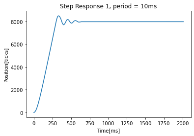
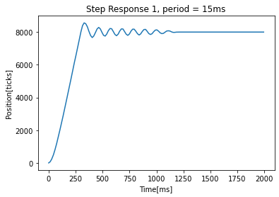
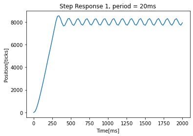
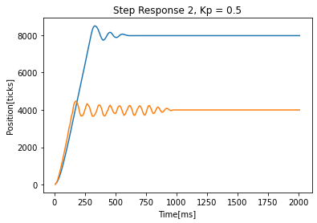

# Lab-3_Ruiz_Martos
## **Encoder Task**
 The Encoder task was created to get practice with shared variables. The encoder task creates an instance of an encoder and then updates with a period of 5ms. It stores the current position of the encoder in a share to be used by the controller motor task
## **Controller Motor Task**
 Our Controller is based solely off of the proportional gain. On initialization, the motor the controller is set with a reference vector (currently in encoder ticks) that is the desired angle of the flywheel. During the controller update, it takes a measured value from the encoder shared variable, calculates the difference between this and the reference, and multiplies by the proportional gain to get a duty cycle. This duty cycle is set on the motor, and the task yields. Our Controller Motor task also is in charge of priting the time and position values. We tried to implement the print_task file provided but we unable to get it working and we were usure of the various errors when trying to use the task. Therefore, this code is slightly blocking but functions well. We created a FSM to cut off the printing of motor time and position after 2 seconds which is a value we selected based on previous step response time.
## **Step Response Test**
 Our Step Response Test comprises of the user inputting a proportional gain constant, the motor running for two seconds to the desired angle of the flywheel, and recording the encoder position ticks and the time it was measured at. In our code, our plot.py creates a serial communication with a Nucleo that has our other files on it. Our plot.py script is meant to be run on the computer, and after establishing connection with the nucleo, instructs the nucleo to quit what it is doing (ctrl + c) and restart (ctrl + d). Upon restart the Nucleo runs main.py which is adventageous for us. We use readline() to parse for the first instance of '111' which signifies that our code is going to begin to output numbers to the serial port. We collect the data until 'done' is shown and then plot based of the results.
## Results

### Figures 1-3
 These first three images show us playing around with the period of the motor task. We had access to one flywheel during this test to find when the period was too large for the controller to reach a steady value. All gain values are set at 0.5. The first image that steadys out is what we expect with a 10ms period. The second image at 15ms, shows that potentially the tasks are getting a little slow and it took close to 2.5 times as long to steady out. The third picture at 20ms shows that this period is too large to reach steady state and is unsteady.

### Figure 4
 This last image shows the functionality of the Task Scheduler with two motors hooked up with a gain of 0.5 and task period of 10ms. One with a setpoint of 4000 ticks and the other 8000 ticks. NOTE: The second motor at a setpoint of 4000 ticks was not hooked up to a flywheel, indicating that potentially with no load the task may need to been faster than 10ms period. 
